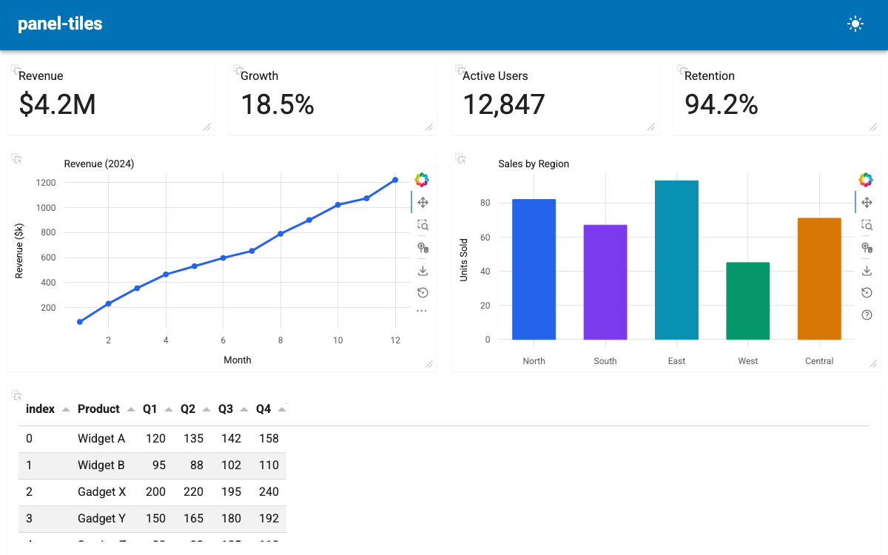

# panel-tiles

**panel-tiles** provides [`TileGrid`](reference/panel-tiles.md), a draggable and resizable grid layout for [Panel](https://panel.holoviz.org/) apps powered by [Muuri](https://muuri.dev/) and [interact.js](https://interactjs.io/).



```python
from panel_tiles import TileGrid

...

grid = TileGrid(
    objects=[
        revenue_ind,
        growth_ind,
        users_ind,
        retention_ind,
        pn.pane.Bokeh(line_fig),
        pn.pane.Bokeh(bar_fig),
        table,
    ],
    layout=[
        {"width": 25, "height": 100, "visible": True},
        {"width": 25, "height": 100, "visible": True},
        {"width": 25, "height": 100, "visible": True},
        {"width": 25, "height": 100, "visible": True},
        {"width": 50, "height": 300, "visible": True},
        {"width": 50, "height": 300, "visible": True},
        {"width": 100, "height": 250, "visible": True},
    ],
    sizing_mode="stretch_width",
    height=750,
)

pmui.Page(main=[grid], title="panel-tiles").servable()
```

## Installation

```bash
pip install panel-tiles
```

## Features

- Drag-and-drop tile reordering
- Resize tiles from the corner handle
- Configurable layout with percentage widths and pixel heights
- Responsive breakpoints with per-breakpoint layouts
- Close buttons with hide or remove behavior
- Persist user layouts to localStorage
- Read-only mode for fixed dashboards
- Dynamic add/remove of tiles at runtime

## How-To Guides

- [Create a Basic Tile Grid](how_to/basic_grid.md)
- [Add and Remove Tiles Dynamically](how_to/dynamic_tiles.md)
- [Configure Close Buttons](how_to/close_action.md)
- [Persist Layout with localStorage](how_to/local_save.md)
- [Create Responsive Layouts](how_to/responsive_breakpoints.md)
- [Create a Read-Only Grid](how_to/read_only.md)

## Reference

- [TileGrid API Reference](reference/panel-tiles.md)
